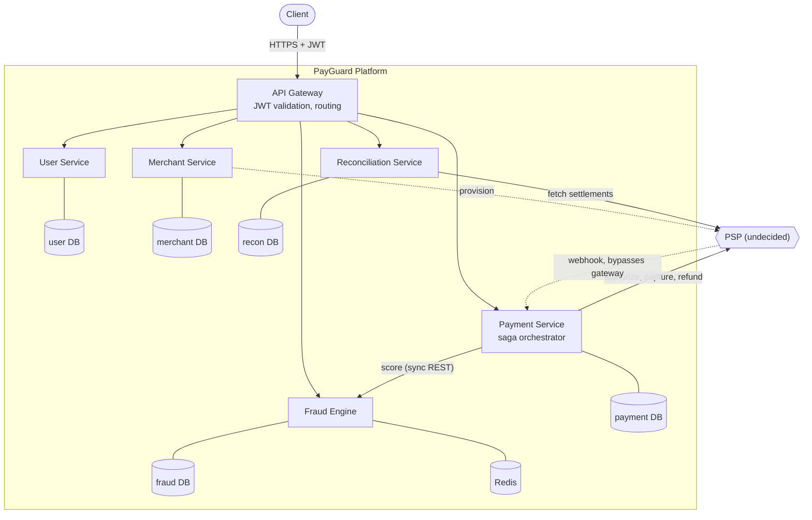

```mermaid
flowchart TB
    Client(["Client"])
    PSP{{"PSP (undecided)"}}

    subgraph PayGuard["PayGuard Platform"]
        APIGW["API Gateway<br/>JWT validation, routing"]

        User["User Service"]
        Merchant["Merchant Service"]
        Payment["Payment Service<br/>saga orchestrator"]
        Fraud["Fraud Engine"]
        Recon["Reconciliation Service"]

        UserDB[("user DB")]
        MerchantDB[("merchant DB")]
        PaymentDB[("payment DB")]
        FraudDB[("fraud DB")]
        Redis[("Redis")]
        ReconDB[("recon DB")]
    end

    Client -->|"HTTPS + JWT"| APIGW
    APIGW --> User & Merchant & Payment & Fraud & Recon

    Payment -->|"score (sync REST)"| Fraud
    Payment -->|"authorize, capture, refund"| PSP
    PSP -.->|"webhook, bypasses gateway"| Payment
    Merchant -.->|"provision"| PSP
    Recon -->|"fetch settlements"| PSP

    User --- UserDB
    Merchant --- MerchantDB
    Payment --- PaymentDB
    Fraud --- FraudDB
    Fraud --- Redis
    Recon --- ReconDB
```